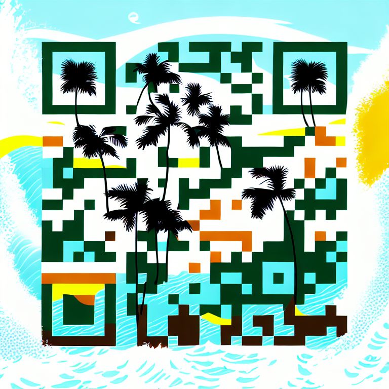

# Digital Harbor

## Deployment

## Sales Pitch

Problem: You want a simple website to serve as a one-stop shop for all the
links related to you - YouTube, Patreon, Venmo, Show Calendar, etc. You'd also
like a kick-awesome QR Code for your followers to simply scan and be brought to
that site... But you aren't sure where to start!

I'm here to help by building your [Digital Harbor](https://mydigitalharbor.com)

The cost to build your site is $100, then the my options are:

1. hand it off - you handle hosting
2. host it at `https://mydigitalharbor.com/{Your Route}` for $5/month. [Example](https://mydigitalharbor.com/1man1-band)
4. host it at a custom domain: $200 Domain Setup (DNS, SSL, etc.) + $10/month + Domain Cost [1man1band.com](https://1man1band.com)

## QR Codes

Here are some examples of QR Codes

>I will generate QR Codes for you for $25/code that you choose to use

QR code for [Digital Harbor](https://mydigitalharbor.com)

QR code for [Digital Harbor](https://mydigitalharbor.com)

QR code for [1man1band.com](https://1man1band.com)

Another QR code for [1man1band.com](https://1man1band.com)
.png)

## Services

1. Your Digital Harbor is inspired from the [Little Link](https://littlelink.io) project. Your Digital Harbor is built with tailwind css and uses [simpleicons](https://simpleicons.org)
2. I host your page for you (the main service of Digital Harbor)
3. Artisanal QR Codes generated with Stable Diffusion

## Roadmap
- Custom and interactive button design (Coming Soon)
- Other providers besides namecheap for DNS
